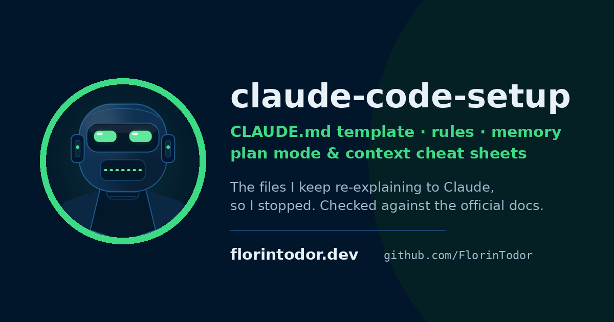

<p align="center">
  
</p>

# claude-code-setup

The files I kept re-explaining to Claude Code, so I stopped. A `CLAUDE.md` template, path-scoped rules, the auto memory layout, and two cheat sheets (plan mode, context). Everything here is checked against the official docs, with the date and the link at the bottom of each file.

*Los archivos que le repetía a Claude Code cada vez, hasta que dejé de hacerlo. Plantilla de `CLAUDE.md`, reglas por carpeta, la estructura de la memoria automática y dos chuletas (plan mode y contexto). Todo contrastado con la documentación oficial. Resumen en castellano al final.*

Not affiliated with Anthropic.

## What is in here

```text
CLAUDE.md                      the template. Copy it, delete what you do not need
CLAUDE.local.md.example        personal notes that stay out of git
.claude/
  rules/python-style.md        loads only when Claude touches src/**/*.py
  rules/testing.md             loads only when Claude touches tests/**/*.py
  settings.example.json        plan mode by default, a few allow/deny rules
memory/
  README.md                    how auto memory is laid out and how to keep it small
  MEMORY.md + *.md             an example index and three example memories
docs/
  plan-mode.md                 how to turn it on, what it does, when to skip it
  context.md                   /clear, /compact, /context, /rewind, and the habits that matter
```

## Use it in 2 minutes

1. Copy `CLAUDE.md` to the root of your repo. Replace every `<placeholder>`. Delete every line you would not miss. The docs say under 200 lines; mine are usually under 80.
2. Copy `.claude/rules/` and adjust the `paths:` globs to your layout. Rules without `paths` load every session; rules with `paths` load only when Claude works on a matching file.
3. Copy `.claude/settings.example.json` to `.claude/settings.json` if you want sessions in that repo to start in plan mode.
4. Start Claude Code and run `/context`. Your `CLAUDE.md` and rules must appear under **Memory files**. If one is missing, Claude cannot see it.
5. Read `memory/README.md` once. You do not create that folder; Claude does. But knowing what goes there explains a lot of its behaviour.

## Why a CLAUDE.md at all

Every session starts with an empty context. Without this file you explain the build command, the layout and the rules again, and Claude guesses in the meantime. With it, the first prompt can be the task.

What belongs in it, from the official best practices:

| Include | Leave out |
| --- | --- |
| Commands Claude cannot guess | Anything it can read from the code |
| Style rules that differ from the defaults | Standard language conventions |
| How to run tests, which runner | Long API docs (link instead) |
| Branch and PR etiquette | Things that change every week |
| Architectural decisions specific to this repo | File-by-file descriptions |
| Gotchas that are not self-evident | "Write clean code" |

If Claude keeps ignoring a rule, the file is probably too long. Prune before adding emphasis. If you must emphasise, mark one line with `IMPORTANT`, not ten.

## Where Claude looks for these files

In load order, broadest first:

| Scope | Path |
| --- | --- |
| Organisation (managed) | `/etc/claude-code/CLAUDE.md` on Linux, `/Library/Application Support/ClaudeCode/CLAUDE.md` on macOS |
| You, every project | `~/.claude/CLAUDE.md` and `~/.claude/rules/` |
| This project | `./CLAUDE.md` or `./.claude/CLAUDE.md`, plus `.claude/rules/*.md` |
| You, this project, not committed | `./CLAUDE.local.md` (add it to `.gitignore`) |
| Subfolders | `sub/CLAUDE.md` loads when Claude first reads or edits a file in `sub/` |

A `CLAUDE.md` can pull in other files with `@path/to/file` on its own line. Imported files load at start too, so imports organise the file but do not make it cheaper.

## Resumen en castellano

- `CLAUDE.md` es el archivo que Claude Code lee al empezar cada sesión. Aquí hay una plantilla con comandos, estructura, convenciones y reglas. Cópiala, rellena los `<placeholder>`, borra lo que no eches de menos. Menos de 200 líneas.
- `.claude/rules/*.md` son reglas por carpeta: con `paths:` en la cabecera solo cargan cuando Claude toca un archivo que encaja.
- `memory/` explica la memoria automática: Claude guarda sus propias notas en `~/.claude/projects/<proyecto>/memory/`, con un índice `MEMORY.md` del que solo se cargan las primeras 200 líneas.
- `docs/plan-mode.md`: `Shift+Tab` hasta ver `plan mode on`, o `/plan` delante del prompt, o `claude --permission-mode plan`. Claude lee y propone, no edita hasta que apruebas.
- `docs/context.md`: `/clear` entre tareas distintas, `/compact` cuando la sesión es larga, `/context` para ver qué hay cargado. Casi todos los "he llegado al límite" son un problema de contexto, no de cuota.

## Sources

- https://code.claude.com/docs/en/memory
- https://code.claude.com/docs/en/permission-modes
- https://code.claude.com/docs/en/best-practices
- https://code.claude.com/docs/en/common-workflows

Checked on 2026-10-09. If something here contradicts the docs, the docs win; open an issue and I will fix it.

MIT. Florin Todor, [florintodor.dev](https://florintodor.dev).
